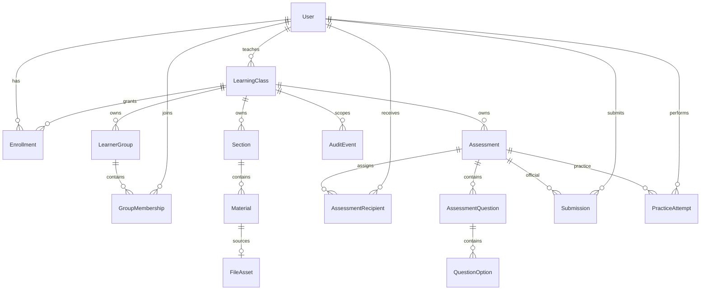

# ERD

```mermaid
erDiagram
  User ||--o{ LearningClass : teaches
  User ||--o{ Enrollment : has
  LearningClass ||--o{ Enrollment : grants
  LearningClass ||--o{ LearnerGroup : owns
  LearnerGroup ||--o{ GroupMembership : contains
  User ||--o{ GroupMembership : joins
  LearningClass ||--o{ Section : owns
  Section ||--o{ Material : contains
  Material ||--o| FileAsset : sources
  LearningClass ||--o{ Assessment : owns
  Assessment ||--o{ AssessmentRecipient : assigns
  User ||--o{ AssessmentRecipient : receives
  Assessment ||--o{ AssessmentQuestion : contains
  AssessmentQuestion ||--o{ QuestionOption : contains
  Assessment ||--o{ Submission : official
  Assessment ||--o{ PracticeAttempt : practice
  User ||--o{ Submission : submits
  User ||--o{ PracticeAttempt : performs
  LearningClass ||--o{ AuditEvent : scopes
```

Cross-table role/scope invariants and the partial unique practice-draft index are in the reviewed SQL migration.
